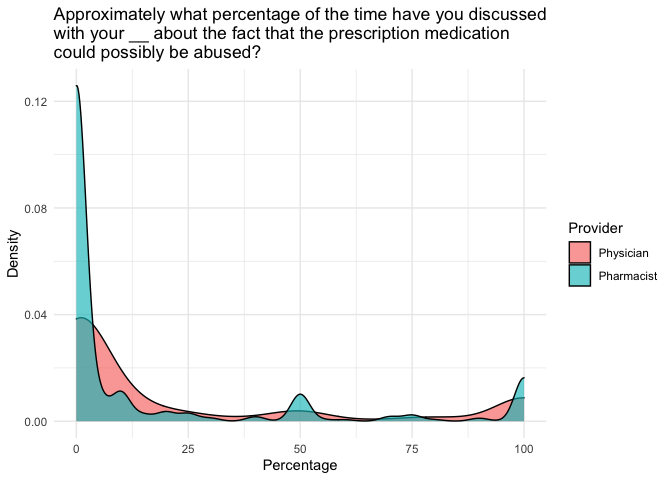
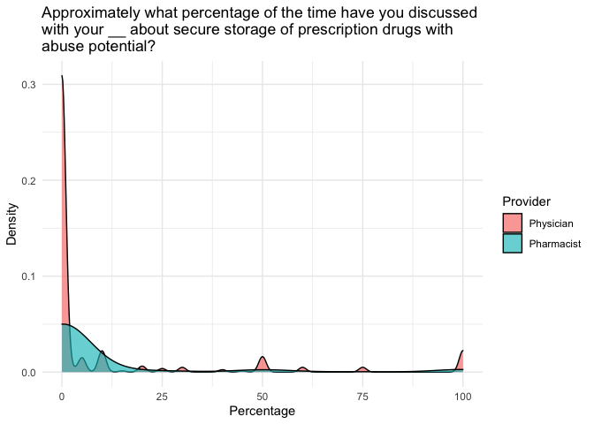
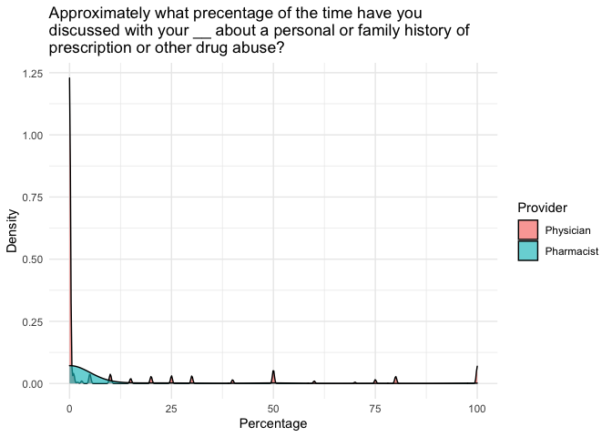
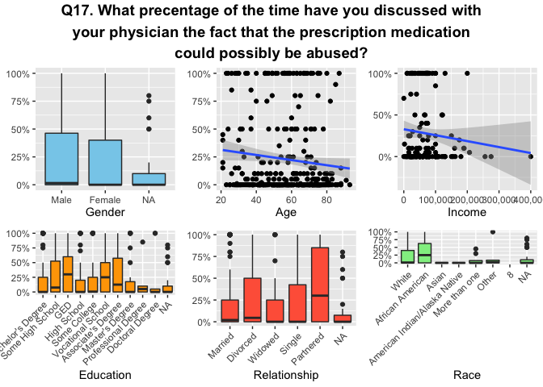
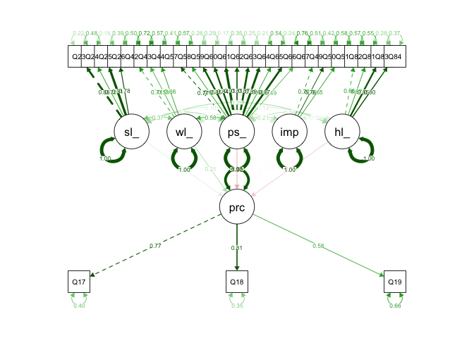

Capstone Markdown
================
Corey Neff
6/29/2021

## Introduction

This project marks the culmination of about a semester’s worth (on &
off) of effort for my internship at the Addiciton Science Center at
ETSU. The project, tentatively titled *“Inter-professional Communication
to Prevent Prescription Drug Abuse in Appalachia”*, is intended to work
to understand mechanisms that lessen the impact of prescription
abuse/misuse in the Appalachian region. In short, the goal of this
project is to determine the extent to which patients communicate with
their Healthcare Providers (HCPs), including both physicians and
pharmacists, about issues surrounding prescription drug abuse.
Additionally, it will include some comparative analysis among the two
HCPs targeted. The work included here is largely visual/graphical in
nature, but will also include some humble models like ordinal logistic
regression, structural equation modeling, and perhaps even simple
machine learning models.

The data was collected from the geographic target of a 21-county area
spanning four states in Central Appalachia via phone, consisting of 60%
cell phone and 40% land-lines.

To begin with, we will load packages needed later and the data.

``` r
librarian::shelf(foreign, RColorBrewer, svglite, scales, ggpubr,
                 here, dplyr, ggplot2, plyr, stringr, tidyr,
                 lavaan, performance, kableExtra, semPlot)
data <- read.spss("/users/coreyneff/desktop/project2data/didarp.sav",
                  to.data.frame = TRUE,
                  use.value.labels = FALSE)
input <- data
input$Q4_RC[input$Q4_RC > 100] <- 100
input$Q9_RC <- input$Q9_RC %>% dplyr::na_if(-99)
input$Q53 <- input$Q53 %>% dplyr::na_if(99)
glimpse(data)
```

    ## Rows: 449
    ## Columns: 108
    ## $ UniqueID       <chr> "C17354", "C20546", "C19421", "C20670", "C20731", "C199…
    ## $ YOB            <dbl> 1988, 1952, 1999, 1991, 1971, 1969, 1968, 1977, 1949, 1…
    ## $ YOB2           <dbl> 997, 997, 997, 997, 997, 997, 997, 997, 997, 997, 997, …
    ## $ Zip            <dbl> 37643, 37857, 37818, 37659, 37660, 37620, 37643, 37620,…
    ## $ Q4_RC          <dbl> 15, 100, 30, 0, 10, 0, 0, 10, 0, 0, 0, 25, 90, 30, 1, 0…
    ## $ Q5_RC          <dbl> 50, 100, 10, 0, 5, 0, 0, 0, 0, 0, 0, 25, 0, 20, 0, 0, 3…
    ## $ Q6_RC          <dbl> 60, 0, 0, 0, 10, 0, 0, 10, 0, 0, NA, 25, 0, 0, 0, 0, 20…
    ## $ Q7_RC          <dbl> 25, 100, 10, 0, 50, 0, 0, 25, 0, 0, 0, 25, 0, 25, 0, 0,…
    ## $ Q8_RC          <dbl> 75, 100, 30, 0, 20, 0, 0, 0, 0, NA, 0, 25, 0, 50, 0, 0,…
    ## $ Q9_RC          <dbl> 5, 0, 0, 0, 25, 0, 0, 0, 0, NA, 0, 25, 0, 10, 0, 0, 0, …
    ## $ Q10            <dbl> 2, 5, 3, 1, 4, 1, 1, 5, 1, 2, 1, 2, 1, 3, 1, 1, 1, 5, 1…
    ## $ Q11            <dbl> 2, 5, 3, 1, 4, 2, 1, 1, 1, 1, 1, 2, 1, 3, 1, 1, 1, 1, 1…
    ## $ Q12            <dbl> 5, 5, 2, 1, 4, 1, 1, 3, 1, 1, 1, 2, 1, 2, 1, 1, 1, 1, 1…
    ## $ Q13            <dbl> 5, 5, 4, 1, 5, 1, 1, 5, 1, NA, 1, 2, 1, 2, 1, 1, 1, 5, …
    ## $ Q14            <dbl> 5, 5, 3, 1, 5, 2, 1, 1, 1, NA, 1, 2, 1, 3, 1, 1, 1, 1, …
    ## $ Q15            <dbl> 1, 5, 2, 1, 5, 1, 1, 3, 1, NA, 1, 2, 1, 2, 1, 1, 1, 1, …
    ## $ Q16            <dbl> 1, 1, 2, 1, 2, 1, 1, 1, 1, 1, 1, 1, 1, 1, 2, 1, 2, 2, 1…
    ## $ Q17_RC         <dbl> 25, 100, NA, 0, NA, 0, 0, 20, 0, NA, 0, 25, 5, 15, NA, …
    ## $ Q18_RC         <dbl> 10, 100, NA, 0, NA, 0, 0, 10, 0, NA, 5, 10, 0, 30, NA, …
    ## $ Q19_RC         <dbl> 80, 0, NA, 0, NA, 0, 0, 20, 0, NA, 0, 0, 0, 20, NA, 0, …
    ## $ Q20_RC         <dbl> 15, 100, NA, 0, NA, 0, 0, 20, 0, NA, 0, 25, 1, 10, NA, …
    ## $ Q21_RC         <dbl> 90, 100, NA, 0, NA, 0, 0, 10, 0, NA, 0, 10, 0, 10, NA, …
    ## $ Q22_RC         <dbl> 0, 0, NA, 0, NA, 0, 0, 10, 0, NA, 0, 0, 0, 20, NA, 0, N…
    ## $ Q23_RC         <dbl> 4, 10, 10, 10, 10, 10, 10, 10, 10, 9, 10, 5, 10, 10, 10…
    ## $ Q24_RC         <dbl> 3, 10, 10, 10, 10, 10, 10, 10, 10, 9, 10, 5, 10, 10, 10…
    ## $ Q25_RC         <dbl> 8, 10, 10, 10, 10, 10, 10, 10, 10, 10, 10, 5, 10, 10, 1…
    ## $ Q26_RC         <dbl> 9, 10, 10, 10, 10, 10, 10, 10, 10, 9, 10, 5, 10, 10, 10…
    ## $ Q27_RC         <dbl> 2, 6, 10, 10, 10, 10, 10, 10, 10, NA, 8, 5, 10, 10, 10,…
    ## $ Q28_RC         <dbl> 10, 6, 10, 10, 10, 10, 10, 10, 10, NA, 10, 5, 10, 10, 1…
    ## $ Q29_RC         <dbl> 6, 6, 10, 10, 10, 10, 10, 10, 10, NA, 8, 5, 10, 10, 10,…
    ## $ Q30_RC         <dbl> 5, 6, 10, 10, 10, 10, 0, 10, 10, NA, 8, 5, 10, 10, 10, …
    ## $ Q31_RC         <dbl> NA, 6, 4, 10, 0, NA, 10, 10, 10, 4, NA, 5, 10, 10, 10, …
    ## $ Q32            <dbl> 1, 1, 2, 1, 2, 1, 1, 1, 1, 3, 1, 3, 1, 1, 1, 1, 1, 1, 1…
    ## $ Q33            <dbl> 4, 4, 3, 3, 2, 4, 4, 4, 4, 2, 4, 4, 4, 4, 4, 4, 4, 4, 4…
    ## $ Q34            <dbl> 1, 1, 1, 1, 2, 1, 1, 1, 1, 4, 1, 1, 1, 1, 1, 1, 1, 1, 1…
    ## $ Q35            <dbl> 1, 1, 1, 1, 2, 1, 1, 1, 1, 4, 1, 1, 1, 1, 1, 1, 1, 1, 1…
    ## $ Q36            <dbl> 4, 4, 3, 4, 2, 4, 4, 4, 4, 1, 4, 4, 4, 4, 4, 4, 4, 4, 4…
    ## $ Q37            <dbl> 1, 2, 1, 2, 1, 1, 1, 1, 1, NA, 1, 1, 1, 1, 1, 1, 1, 1, …
    ## $ Q38            <dbl> 4, 2, 3, 4, 4, 4, 4, 4, 4, NA, 4, 4, 4, 4, 4, 4, 4, 4, …
    ## $ Q39            <dbl> 1, 2, 1, 1, 1, 1, 1, 1, 1, NA, 1, 1, 1, 1, 1, 1, 1, 4, …
    ## $ Q40            <dbl> 1, 2, 2, 1, 1, 1, 1, 1, 1, NA, 1, 1, 1, 1, 1, 1, 1, 4, …
    ## $ Q41            <dbl> 4, 2, 3, 4, 4, 4, 4, 4, 4, NA, 4, 4, 4, 4, 4, 4, 4, 4, …
    ## $ BreakOff1      <dbl> 2, 2, 2, 2, 2, 2, 2, 2, 2, 2, 2, 2, 2, 2, 2, 2, 2, 2, 2…
    ## $ Q42            <dbl> 5, 5, 5, 5, 3, 5, 5, 5, 5, 4, 5, 5, 5, 5, 5, 5, 5, 4, 5…
    ## $ Q43            <dbl> 4, 5, 3, 5, 4, 5, 5, 5, 5, 2, 5, 5, 5, 5, 4, 5, 5, 5, 5…
    ## $ Q44            <dbl> 5, 5, 5, 5, 4, 5, 5, 5, 5, 5, 5, 5, 5, 5, 5, 5, 5, 5, 5…
    ## $ Q45            <dbl> 3, 1, 5, 1, 2, 1, 1, 5, 5, 3, 1, 5, 1, 5, 5, 5, 1, 1, 1…
    ## $ Q46            <dbl> 2, 1, 1, 5, 1, 1, 1, 1, 2, 1, 1, 5, 1, 2, 1, 1, 1, 1, 2…
    ## $ Q47            <dbl> 4, 1, 1, 1, 1, 1, 1, 3, 2, NA, 1, 5, 1, 4, 4, 5, 1, 1, …
    ## $ Q48            <dbl> 1, 1, 1, 2, 1, 1, 1, 3, 1, NA, 1, 5, 1, 2, 1, 1, 1, 1, …
    ## $ Q49            <dbl> 5, 1, NA, 4, 4, 4, 5, 4, 5, 2, 3, 4, 5, 4, 2, 2, 5, 3, …
    ## $ Q50            <dbl> 2, 1, NA, 4, 4, 4, 5, 4, 5, 2, 5, 4, 5, 2, 2, 2, 4, 2, …
    ## $ Q51            <dbl> 5, 1, NA, 4, 4, 4, 5, 4, 5, 2, 5, 4, 5, 2, 2, 2, 5, 4, …
    ## $ Q52            <dbl> 4, 1, NA, 4, 4, 4, 5, 4, 5, 4, 2, 4, 5, 2, 2, 2, 5, 2, …
    ## $ Q53            <dbl> 2, 1, NA, 4, 4, 4, 5, 4, 3, 2, 2, 4, 5, 2, 2, 2, 5, 2, …
    ## $ Q54            <dbl> 5, 1, NA, 4, 4, 4, 5, 4, 5, 4, 4, 4, 5, 2, 2, 2, 5, 4, …
    ## $ Q55            <dbl> 1, 1, NA, 2, 1, 1, 1, 1, 1, 1, 1, 2, 1, NA, 1, 1, 1, 1,…
    ## $ Q56            <dbl> 3, 4, NA, NA, 4, 4, 3, 4, 1, 4, 4, NA, 4, NA, 2, 4, 2, …
    ## $ Q57            <dbl> 5, 5, NA, NA, 5, 5, 5, 5, 4, 4, 5, 2, 5, NA, 5, 5, 5, 5…
    ## $ Q58            <dbl> 5, 5, NA, NA, 3, 5, 3, 5, 3, 1, 5, 2, 5, NA, 5, 5, 5, 5…
    ## $ Q59            <dbl> 5, 5, NA, NA, 5, 5, 5, 5, 3, 3, 5, 2, 5, NA, 5, 5, 5, 5…
    ## $ Q60            <dbl> 5, 5, NA, NA, 4, 5, 5, 5, 3, 3, 5, 2, 5, NA, 5, 5, 5, 5…
    ## $ Q61            <dbl> 5, 5, NA, NA, 5, 5, 5, 5, 5, 3, 5, 2, 5, NA, 5, 5, 5, 5…
    ## $ Q62            <dbl> 5, 5, NA, NA, 5, 5, 5, 5, 5, 3, 5, 2, 5, NA, 5, 5, 5, 5…
    ## $ Q63            <dbl> 5, 5, NA, NA, 4, 5, 5, 5, 5, 1, 5, 2, 5, NA, 5, 5, 5, 5…
    ## $ Q64            <dbl> 5, 5, NA, NA, 5, 5, 5, 5, 5, 1, 5, 2, 5, NA, 5, 5, 5, 5…
    ## $ Q65            <dbl> 5, 5, NA, NA, 3, 5, 3, 5, 3, 1, 5, 2, 5, NA, 3, 5, 5, 5…
    ## $ Q66            <dbl> 5, 5, NA, NA, 5, 5, 5, 5, 5, 2, 5, 2, 5, NA, 5, 5, 5, 5…
    ## $ Q67            <dbl> 5, 1, NA, NA, 5, 5, 1, 4, 3, 1, 5, 2, 1, NA, 4, 5, 5, 5…
    ## $ BreakOff2      <dbl> 2, 2, 1, 2, 2, 2, 2, 2, 2, 2, 2, 2, 2, 1, 2, 2, 2, 2, 2…
    ## $ Q68            <dbl> 1, 1, NA, 2, 1, 1, 2, 2, 1, 2, 1, 2, 1, NA, 1, 1, 1, 2,…
    ## $ Q69            <dbl> 4, 4, NA, NA, 4, 4, NA, NA, 4, NA, 4, NA, 4, NA, 4, 4, …
    ## $ Q70            <dbl> 5, 5, NA, NA, 5, 5, 5, 5, 3, NA, 5, 2, 5, NA, 4, 5, 5, …
    ## $ Q71            <dbl> 2, 5, NA, NA, 5, 5, 1, 5, 3, NA, 5, 2, 5, NA, 5, 5, 5, …
    ## $ Q72            <dbl> 5, 5, NA, NA, 5, 5, 5, 5, 3, NA, 3, 2, 5, NA, 5, 5, 5, …
    ## $ Q73            <dbl> 5, 5, NA, 5, 5, 5, 3, 4, 3, NA, 3, 2, 5, NA, 5, 5, 5, 5…
    ## $ Q74            <dbl> 5, 5, NA, NA, 5, 5, 5, 5, 3, NA, 5, 2, 5, NA, 5, 5, 5, …
    ## $ Q75            <dbl> 5, 5, NA, NA, 5, 5, 5, 5, 3, NA, 5, 2, 5, NA, 5, 5, 5, …
    ## $ Q76            <dbl> 2, 5, NA, NA, 5, 5, 5, 5, 3, NA, 3, 2, 5, NA, 5, 5, 5, …
    ## $ Q77            <dbl> 5, 5, NA, NA, 5, 5, 5, 5, 3, NA, 5, 2, 5, NA, 5, 5, 5, …
    ## $ Q78            <dbl> 2, 5, NA, NA, 5, 5, 1, 5, 3, NA, 5, 2, 5, NA, 4, 5, 5, …
    ## $ Q79            <dbl> 5, 5, NA, NA, 5, 5, 5, 5, 3, NA, 5, 2, 5, NA, 4, 5, 5, …
    ## $ Q80            <dbl> 5, 5, NA, NA, 5, 5, 5, 5, 3, NA, 5, 2, 5, NA, 5, 5, 5, …
    ## $ Q82            <dbl> 5, 5, NA, 5, 4, 4, 5, 5, 4, 5, 5, 2, 5, NA, NA, 5, 5, 5…
    ## $ Q81            <dbl> 5, 5, NA, NA, 5, 5, 5, 5, 5, 5, 5, 2, 5, NA, 2, 5, 5, 5…
    ## $ Q83            <dbl> 5, 5, NA, 5, 5, 5, 5, 5, 3, 5, 5, 4, 5, NA, 5, 5, 5, 5,…
    ## $ Q84            <dbl> 5, 4, NA, 5, 5, 5, 5, 5, 4, 4, 5, 4, 5, NA, 3, 5, 5, 5,…
    ## $ Q85_RC         <dbl> 0, 0, NA, 0, 0, 0, 0, 0, 0, 0, 0, 0, 0, NA, 0, 0, 0, 0,…
    ## $ Q86            <dbl> 3, 1, NA, 1, 3, 1, 3, 1, 3, 2, 1, 3, 2, NA, 1, 2, 2, 1,…
    ## $ Q86b           <dbl> 2, NA, NA, NA, 1, NA, 1, NA, 2, NA, NA, NA, NA, NA, NA,…
    ## $ Q87            <dbl> 3, 1, NA, 1, 2, 2, 3, 2, 3, 3, 1, 3, 2, NA, 2, 4, 3, 3,…
    ## $ Q88            <dbl> 1, 1, NA, NA, 4, 1, 2, 1, 1, 1, 1, 2, 2, NA, 1, 1, 3, 1…
    ## $ Q89            <dbl> 1, 1, NA, 1, 1, 1, 2, 1, 1, 2, 2, 1, 2, NA, 2, 2, 2, 1,…
    ## $ Q90            <dbl> 2, 1, NA, NA, 1, 1, 1, 2, 2, 1, 2, 2, 2, NA, 2, 1, 1, 1…
    ## $ Q91            <dbl> NA, NA, NA, NA, NA, NA, NA, NA, NA, NA, NA, NA, NA, NA,…
    ## $ Q92_RC         <dbl> 20000, NA, NA, NA, NA, NA, 50000, 60000, 42000, NA, 600…
    ## $ Q92b           <dbl> NA, 7, NA, NA, 4, 5, NA, NA, NA, NA, NA, 2, NA, NA, NA,…
    ## $ Q93            <dbl> 2, 2, NA, 2, 2, 2, 2, 2, 2, 2, 2, 2, 2, NA, 2, 2, 2, 2,…
    ## $ Q94            <dbl> 1, 1, NA, NA, 1, 1, 1, 1, 1, 7, 1, 1, 1, NA, 1, 1, 1, 1…
    ## $ Q94_Other_TEXT <chr> ".              ", ".              ", "               "…
    ## $ Q95            <dbl> 3, 4, NA, 3, 8, 8, 7, 7, 7, 7, 8, 3, 3, NA, 7, 7, 3, 7,…
    ## $ Land           <dbl> NA, NA, NA, NA, NA, NA, NA, NA, NA, NA, NA, NA, NA, NA,…
    ## $ Cell           <dbl> 1, 1, NA, 1, NA, 1, 1, 1, 1, 1, 1, 1, 1, 1, 1, 1, 1, 1,…
    ## $ County         <chr> "Carter    ", "Hawkins   ", "Greene    ", "Washington",…
    ## $ CoQual         <chr> "1", "1", "1", "1", "1", "1", "1", "1", "1", "1", "1", …
    ## $ BreakOff       <chr> " ", " ", " ", " ", " ", " ", " ", " ", " ", " ", " ", …
    ## $ Partial        <dbl> NA, NA, 1, NA, NA, NA, NA, NA, NA, NA, NA, NA, NA, 1, N…
    ## $ Complete       <dbl> 1, 1, NA, 1, 1, 1, 1, 1, 1, 1, 1, 1, 1, NA, 1, 1, 1, 1,…

## Summary

There are a total of 108 variables, but we will not be using most of
them. The main outcome variables are questions 17-22. Questions 17-19
ask questions about communication with physicians, while 20-22 ask the
same questions about pharmacists. In order from question 17 to 19,
physician-related questions read:

In the past, when you have gotten a prescription for a pain pill or
another type of drug that could be abused, approximately what percentage
of the time have you…

17. Discussed the fact that the prescription medication could possibly
    be abused?

18. Discussed secure storage of prescription drugs with abuse potential?

19. Discussed a personal or family history of prescription or other drug
    abuse?

Again, these three physician-related questions are repeated in questions
20 to 22 for pharmacists instead. Because they are the same questions,
it may be beneficial to compare their responses visually. As such, three
graphics will follow: one for each pair of comparisons.

``` r
input %>% tidyr::pivot_longer(cols = c(Q17_RC, Q20_RC),
                                   names_to = "Q20",
                                   values_to = "Q20_scale") %>%
      dplyr::select(Q20, Q20_scale) %>%
      ggplot() +
      geom_density(aes(Q20_scale, fill = Q20), alpha = 0.65) +
      labs(fill = "Provider") +
      scale_fill_discrete(labels = c("Physician",
                                     "Pharmacist")) +
      xlab("Percentage") + 
      ylab("Density") +
      ggtitle(str_wrap("Approximately what percentage of the time have you discussed with your __ about the fact that the prescription medication could possibly be abused?", 60)) +
      theme(axis.text.x = element_text(angle = 0)) +
      theme_minimal()
```

<!-- -->

``` r
input %>% tidyr::pivot_longer(cols = c(Q18_RC, Q21_RC),
                                   names_to = "Q21",
                                   values_to = "Q21_scale") %>%
      dplyr::select(Q21, Q21_scale) %>%
      ggplot() +
      geom_density(aes(Q21_scale, fill = Q21), alpha = 0.65) +
      labs(fill = "Provider") +
      scale_fill_discrete(labels = c("Physician",
                                     "Pharmacist")) +
      xlab("Percentage") + 
      ylab("Density") +
      ggtitle(str_wrap("Approximately what percentage of the time have you discussed with your __ about secure storage of prescription drugs with abuse potential?", 60)) +
      theme(axis.text.x = element_text(angle = 0)) +
      theme_minimal() 
```

<!-- -->

``` r
input %>% tidyr::pivot_longer(cols = c(Q19_RC, Q22_RC),
                                   names_to = "Q22",
                                   values_to = "Q22_scale") %>%
      dplyr::select(Q22, Q22_scale) %>%
      ggplot() +
      geom_density(aes(Q22_scale, fill = Q22), alpha = 0.65) +
      labs(fill = "Provider") +
      scale_fill_discrete(labels = c("Physician",
                                     "Pharmacist")) +
      xlab("Percentage") + 
      ylab("Density") +
      ggtitle(str_wrap("Approximately what precentage of the time have you discussed with your __ about a personal or family history of prescription or other drug abuse?",60)) +
      theme(axis.text.x = element_text(angle = 0)) +
      theme_minimal()
```

<!-- -->

## Immediate Problems

As we can see, one immediate problem is made clear from this data
visualization – non-normality. This is partly to be expected, however.
If you ask people what percentage of the time they do something, chances
are they will ride the fence to some degree. This effect becomes much
more pronounced with the second two questions of the three (re: secure
storage, family history of drug abuse). In a perfect world, we might
assume (or hope, even) that the high frequencies of “0%” don’t reflect
what is actually going on (i.e. it can be explained as some form of
response bias), but I think it is best to take this data at face value.
In other words, people *really* tend not to speak with their pharmacists
and physicians about these two topics.

The next thing I would be interested in is the demographic spread for
each question 17 through 22. There were six main demographic variables
of interest: age, race, education, income, relationship status, and
gender. I will proceed to visualize these for each response question,
but only the code for question 17 will be included for simplicity. The
remaining graphics can be found in the github plots folder. First,
however, I intend to do some light releveling of the the relevant
factors.

``` r
input$Q94 <- revalue(as.factor(input$Q94), c("1" = "White",
                                                     "2" = "African American",
                                                     "3" = "Asian",
                                                     "4" = "American Indian/Alaska Native",
                                                     "5" = "Native Hawaiin/Pacific Islander",
                                                     "6" = "More than one",
                                                     "7" = "Other"))
```

    ## The following `from` values were not present in `x`: 5

``` r
input$Q94 <- relevel(input$Q94, ref='White')
input$Q95 <- revalue(as.factor(input$Q95), c("1" = "Some High School",
                                                     "2" = "GED",
                                                     "3" = "High School",
                                                     "4" = "Some College",
                                                     "5" = "Vocational School",
                                                     "6" = "Associate's Degree",
                                                     "7" = "Bachelor's Degree",
                                                     "8" = "Master's Degree",
                                                     "9" = "Professional Degree",
                                                     "10" = "Doctoral Degree"))
input$Q95 <- relevel(input$Q95, ref="Bachelor's Degree")
input$Q89 <- revalue(as.factor(input$Q89), c("1" = "Male",
                                                     "2" = "Female"))
input$Q89 <- relevel(input$Q89, ref="Male")
input$Q88 <- revalue(as.factor(input$Q88), c("1" = "Married",
                                                     "2" = "Divorced",
                                                     "3" = "Widowed",
                                                     "4" = "Single",
                                                     "5" = "Partnered"))
input$Q88 <- relevel(input$Q88, ref="Married")
Q17_1 <- input %>% 
      ggplot(aes(y=Q17_RC)) +
      geom_boxplot(aes(x=Q89), fill = "skyblue") +
      theme(axis.title.y = element_blank()) +
      scale_y_continuous(labels = scales::percent_format(scale=1)) +
      xlab("Gender")

Q17_2 <- input %>% 
      ggplot(aes(y=Q17_RC)) +
      geom_boxplot(aes(x=Q88), fill = "tomato") +
      theme(axis.text.x = element_text(angle = 45, hjust=1),
            axis.title.y=element_blank()) +
      scale_y_continuous(labels = scales::percent_format(scale=1)) +
      xlab("Relationship")

Q17_3 <- input %>% 
      ggplot(aes(y=Q17_RC)) +
      geom_boxplot(aes(x=Q94), fill = "lightgreen") +
      theme(axis.text.x = element_text(angle = 45, hjust=1),
            axis.title.y=element_blank()) +
      scale_y_continuous(labels = scales::percent_format(scale=1)) +
      xlab("Race")

Q17_4 <- input %>% 
      ggplot(aes(y=Q17_RC)) +
      geom_boxplot(aes(x=Q95), fill = "orange") +
      theme(axis.text.x = element_text(angle = 45, hjust=1),
            axis.title.y=element_blank()) +
      scale_y_continuous(labels = scales::percent_format(scale=1)) +
      xlab("Education")

Q17_5 <- input %>% 
      ggplot(aes(y=Q17_RC)) +
      geom_point(aes(x=2021-YOB)) +
      geom_smooth(aes(x=2021-YOB), method = "lm") +
      scale_y_continuous(labels = scales::percent_format(scale=1)) +
      theme(axis.title.y = element_blank()) + 
      xlab("Age")

Q17_6 <- input %>% 
      ggplot(aes(y=Q17_RC)) +
      geom_point(aes(x=Q92_RC)) +
      geom_smooth(aes(x=Q92_RC), method = "lm") +
      scale_x_continuous(labels = scales::comma) +
      scale_y_continuous(labels = scales::percent_format(scale=1)) +
      theme(axis.title.y = element_blank()) +
      xlab("Income")

arrange1 <- ggpubr::ggarrange(Q17_1,Q17_5,Q17_6,Q17_4,Q17_2,Q17_3, ncol = 3, nrow=2)
```

    ## `geom_smooth()` using formula 'y ~ x'

    ## `geom_smooth()` using formula 'y ~ x'

``` r
ggpubr::annotate_figure(arrange1,top = text_grob(str_wrap(
      "Q17. What precentage of the time have you discussed with your physician the fact that the prescription medication could possibly be abused?",60), 
      color = "black", face = "bold", size = 14))
```

<!-- -->

## Demographics

As you can see, the non normality of both the spread of demographics and
responses to question 17 make for some very cluttered visuals. Generally
speaking, though, as both age and income increase, people spend less
time communicating with their physicians about prescription drug abuse.
It is hard to gain much insight from the discrete demographics like
gender and education, but those who are male, partnered, have a GED, and
African American seem to have a slightly higher median percentage. This
could be just an artifact of the data, though.

Now that we’ve got some basic visualizations done, we can perhaps dip
our toes into some modeling. To my mind, there are a handful of ways we
can model the data, each with their own flaws.

1.  Conduct an ANOVA to test mean differences among the relevant
    demographic groups.

2.  Recode the continuous “What percentage of the time…” response
    variable as a binary “Yes”/“No” to help get around the zero
    inflation happening, then do a simple logistic regression.

3.  Do a confirmatory factor analysis followed by a structural equation
    model. The questionnaire is thoroughly grounded in theory,
    incorporating many constructs related to health-decision theories
    like the Theory of Planned Behavior. Because of that, many of the
    questions can be assigned to a latent construct for further
    analysis.

I am largely partial to the structural equation modeling approach
because I would like more practice doing so. To complete this, we simply
need to specify the constructs for the model, conduct a confirmatory
factor analysis for a hypothesis test on these constructs, then feed the
confirmed latent constructs into the structural equation model.

In the interest of brevity, I won’t go into depth on the questions
included in each proposed factor. It will be important to note, however,
that the questions are all ordinal on a scale from 1-10. Normally,
factor analysis and structural equation modeling assumes continuous and
normally distributed constituents. In this case I am hoping the ordinal
responses will approximate that. The factors included are:

1.  *Self\_efficacy* – Self efficacy to communicate with HCP
2.  *Would\_communicate* – Openness to communicate with HCP
3.  *Impact* – Impact of history of drug use on HCP attitudes towards
    patient.
4.  *Positive\_attitude* – Positive attitudes toward HCP
5.  *Health\_literacy* – General health literacy
6.  *Percentage* – What percentage of the time do you speak with your
    HCP about topics surrounding prescription drug abuse

``` r
parameters <- 'self_efficacy =~ Q23_RC+Q24_RC+Q25_RC+Q26_RC
            would_communicate =~ Q42+Q43+Q44
            impact =~ Q49+Q50+Q51
            positive_attitude =~ Q57+Q58+Q59+Q60+Q61+Q62+Q63+Q64+Q65+Q66+Q67
            health_literacy =~ Q82+Q81+Q83+Q84
            percentage =~ Q17_RC+Q18_RC+Q19_RC'

cfa_fit <- lavaan::cfa(parameters, data = input, std.lv=TRUE)
summary(cfa_fit, fit.measures=T,standardized=T)
```

    ## lavaan 0.6-8 ended normally after 42 iterations
    ## 
    ##   Estimator                                         ML
    ##   Optimization method                           NLMINB
    ##   Number of model parameters                        71
    ##                                                       
    ##                                                   Used       Total
    ##   Number of observations                           269         449
    ##                                                                   
    ## Model Test User Model:
    ##                                                       
    ##   Test statistic                               700.184
    ##   Degrees of freedom                               335
    ##   P-value (Chi-square)                           0.000
    ## 
    ## Model Test Baseline Model:
    ## 
    ##   Test statistic                              4781.362
    ##   Degrees of freedom                               378
    ##   P-value                                        0.000
    ## 
    ## User Model versus Baseline Model:
    ## 
    ##   Comparative Fit Index (CFI)                    0.917
    ##   Tucker-Lewis Index (TLI)                       0.906
    ## 
    ## Loglikelihood and Information Criteria:
    ## 
    ##   Loglikelihood user model (H0)             -12218.516
    ##   Loglikelihood unrestricted model (H1)     -11868.424
    ##                                                       
    ##   Akaike (AIC)                               24579.031
    ##   Bayesian (BIC)                             24834.256
    ##   Sample-size adjusted Bayesian (BIC)        24609.140
    ## 
    ## Root Mean Square Error of Approximation:
    ## 
    ##   RMSEA                                          0.064
    ##   90 Percent confidence interval - lower         0.057
    ##   90 Percent confidence interval - upper         0.070
    ##   P-value RMSEA <= 0.05                          0.000
    ## 
    ## Standardized Root Mean Square Residual:
    ## 
    ##   SRMR                                           0.048
    ## 
    ## Parameter Estimates:
    ## 
    ##   Standard errors                             Standard
    ##   Information                                 Expected
    ##   Information saturated (h1) model          Structured
    ## 
    ## Latent Variables:
    ##                        Estimate  Std.Err  z-value  P(>|z|)   Std.lv  Std.all
    ##   self_efficacy =~                                                          
    ##     Q23_RC                2.008    0.113   17.804    0.000    2.008    0.881
    ##     Q24_RC                1.922    0.144   13.360    0.000    1.922    0.724
    ##     Q25_RC                2.080    0.111   18.672    0.000    2.080    0.907
    ##     Q26_RC                2.075    0.140   14.817    0.000    2.075    0.779
    ##   would_communicate =~                                                      
    ##     Q42                   0.364    0.034   10.833    0.000    0.364    0.709
    ##     Q43                   0.371    0.046    8.011    0.000    0.371    0.534
    ##     Q44                   0.574    0.057   10.014    0.000    0.574    0.656
    ##   impact =~                                                                 
    ##     Q49                   0.775    0.071   10.925    0.000    0.775    0.703
    ##     Q50                   0.914    0.078   11.789    0.000    0.914    0.764
    ##     Q51                   0.573    0.056   10.159    0.000    0.573    0.651
    ##   positive_attitude =~                                                      
    ##     Q57                   0.683    0.046   14.904    0.000    0.683    0.771
    ##     Q58                   0.743    0.062   11.915    0.000    0.743    0.654
    ##     Q59                   0.872    0.050   17.302    0.000    0.872    0.851
    ##     Q60                   0.944    0.055   17.068    0.000    0.944    0.844
    ##     Q61                   0.879    0.045   19.342    0.000    0.879    0.910
    ##     Q62                   0.851    0.053   15.928    0.000    0.851    0.807
    ##     Q63                   0.830    0.047   17.802    0.000    0.830    0.866
    ##     Q64                   0.932    0.050   18.540    0.000    0.932    0.888
    ##     Q65                   0.817    0.066   12.434    0.000    0.817    0.676
    ##     Q66                   0.859    0.048   18.006    0.000    0.859    0.872
    ##     Q67                   0.677    0.080    8.508    0.000    0.677    0.494
    ##   health_literacy =~                                                        
    ##     Q82                   0.639    0.057   11.286    0.000    0.639    0.656
    ##     Q81                   0.618    0.054   11.533    0.000    0.618    0.668
    ##     Q83                   0.841    0.053   15.751    0.000    0.841    0.847
    ##     Q84                   0.764    0.053   14.471    0.000    0.764    0.795
    ##   percentage =~                                                             
    ##     Q17_RC               28.777    2.354   12.225    0.000   28.777    0.774
    ##     Q18_RC               21.527    1.694   12.708    0.000   21.527    0.806
    ##     Q19_RC               15.357    1.656    9.276    0.000   15.357    0.581
    ## 
    ## Covariances:
    ##                        Estimate  Std.Err  z-value  P(>|z|)   Std.lv  Std.all
    ##   self_efficacy ~~                                                          
    ##     would_communct        0.373    0.069    5.382    0.000    0.373    0.373
    ##     impact                0.100    0.073    1.375    0.169    0.100    0.100
    ##     positive_atttd        0.254    0.061    4.158    0.000    0.254    0.254
    ##     health_litercy        0.247    0.065    3.788    0.000    0.247    0.247
    ##     percentage            0.070    0.071    0.986    0.324    0.070    0.070
    ##   would_communicate ~~                                                      
    ##     impact                0.069    0.084    0.821    0.412    0.069    0.069
    ##     positive_atttd        0.577    0.057   10.199    0.000    0.577    0.577
    ##     health_litercy        0.117    0.079    1.475    0.140    0.117    0.117
    ##     percentage            0.103    0.082    1.256    0.209    0.103    0.103
    ##   impact ~~                                                                 
    ##     positive_atttd        0.213    0.069    3.096    0.002    0.213    0.213
    ##     health_litercy        0.085    0.075    1.129    0.259    0.085    0.085
    ##     percentage           -0.042    0.079   -0.530    0.596   -0.042   -0.042
    ##   positive_attitude ~~                                                      
    ##     health_litercy        0.181    0.065    2.770    0.006    0.181    0.181
    ##     percentage           -0.096    0.069   -1.392    0.164   -0.096   -0.096
    ##   health_literacy ~~                                                        
    ##     percentage           -0.127    0.073   -1.743    0.081   -0.127   -0.127
    ## 
    ## Variances:
    ##                    Estimate  Std.Err  z-value  P(>|z|)   Std.lv  Std.all
    ##    .Q23_RC            1.166    0.157    7.449    0.000    1.166    0.224
    ##    .Q24_RC            3.348    0.322   10.389    0.000    3.348    0.475
    ##    .Q25_RC            0.927    0.149    6.208    0.000    0.927    0.177
    ##    .Q26_RC            2.781    0.282    9.878    0.000    2.781    0.393
    ##    .Q42               0.131    0.018    7.156    0.000    0.131    0.498
    ##    .Q43               0.346    0.035    9.888    0.000    0.346    0.715
    ##    .Q44               0.437    0.053    8.257    0.000    0.437    0.570
    ##    .Q49               0.614    0.082    7.484    0.000    0.614    0.505
    ##    .Q50               0.595    0.101    5.906    0.000    0.595    0.416
    ##    .Q51               0.447    0.052    8.640    0.000    0.447    0.577
    ##    .Q57               0.318    0.029   10.926    0.000    0.318    0.405
    ##    .Q58               0.739    0.066   11.257    0.000    0.739    0.573
    ##    .Q59               0.290    0.028   10.392    0.000    0.290    0.276
    ##    .Q60               0.361    0.034   10.463    0.000    0.361    0.288
    ##    .Q61               0.161    0.017    9.378    0.000    0.161    0.172
    ##    .Q62               0.389    0.036   10.744    0.000    0.389    0.349
    ##    .Q63               0.230    0.022   10.217    0.000    0.230    0.250
    ##    .Q64               0.234    0.024    9.886    0.000    0.234    0.212
    ##    .Q65               0.796    0.071   11.214    0.000    0.796    0.544
    ##    .Q66               0.232    0.023   10.135    0.000    0.232    0.239
    ##    .Q67               1.419    0.124   11.450    0.000    1.419    0.756
    ##    .Q82               0.540    0.054   10.048    0.000    0.540    0.569
    ##    .Q81               0.475    0.048    9.947    0.000    0.475    0.554
    ##    .Q83               0.278    0.045    6.228    0.000    0.278    0.282
    ##    .Q84               0.340    0.043    7.819    0.000    0.340    0.368
    ##    .Q17_RC          555.829   93.311    5.957    0.000  555.829    0.402
    ##    .Q18_RC          249.789   49.651    5.031    0.000  249.789    0.350
    ##    .Q19_RC          461.682   46.236    9.985    0.000  461.682    0.662
    ##     self_efficacy     1.000                               1.000    1.000
    ##     would_communct    1.000                               1.000    1.000
    ##     impact            1.000                               1.000    1.000
    ##     positive_atttd    1.000                               1.000    1.000
    ##     health_litercy    1.000                               1.000    1.000
    ##     percentage        1.000                               1.000    1.000

## Confirmatory Factor Analysis

These CFI and TLI are both \~0.90, which is good. This model fails the
normal RMSEA cutoff of \~0.06 but comes acceptably close, in this case
0.064. The SRMR of 0.048 is below the cutoff of \~0.08. Additionally,
all latent constructs seems to be significant. This is all indicative of
a decent model fit. There may be some concern with covariance between
the “Impact” and “Percentage” variables, but this level should be fine.

``` r
parameters <- 'self_efficacy =~ Q23_RC+Q24_RC+Q25_RC+Q26_RC
            would_communicate =~ Q42+Q43+Q44
            positive_attitude =~ Q57+Q58+Q59+Q60+Q61+Q62+Q63+Q64+Q65+Q66+Q67
            impact =~ Q49+Q50+Q51
            health_literacy =~ Q82+Q81+Q83+Q84
            percentage =~ Q17_RC+Q18_RC+Q19_RC
            percentage ~ self_efficacy + would_communicate +
            positive_attitude + health_literacy + impact'

sem_model <- lavaan::sem(parameters, data = input, se="bootstrap")
```

    ## Warning in lav_data_full(data = data, group = group, cluster = cluster, : lavaan
    ## WARNING: some observed variances are (at least) a factor 1000 times larger than
    ## others; use varTable(fit) to investigate

``` r
summary(sem_model, fit.measures = T, rsquare = T)
```

    ## lavaan 0.6-8 ended normally after 211 iterations
    ## 
    ##   Estimator                                         ML
    ##   Optimization method                           NLMINB
    ##   Number of model parameters                        71
    ##                                                       
    ##                                                   Used       Total
    ##   Number of observations                           269         449
    ##                                                                   
    ## Model Test User Model:
    ##                                                       
    ##   Test statistic                               700.184
    ##   Degrees of freedom                               335
    ##   P-value (Chi-square)                           0.000
    ## 
    ## Model Test Baseline Model:
    ## 
    ##   Test statistic                              4781.362
    ##   Degrees of freedom                               378
    ##   P-value                                        0.000
    ## 
    ## User Model versus Baseline Model:
    ## 
    ##   Comparative Fit Index (CFI)                    0.917
    ##   Tucker-Lewis Index (TLI)                       0.906
    ## 
    ## Loglikelihood and Information Criteria:
    ## 
    ##   Loglikelihood user model (H0)             -12218.516
    ##   Loglikelihood unrestricted model (H1)     -11868.424
    ##                                                       
    ##   Akaike (AIC)                               24579.031
    ##   Bayesian (BIC)                             24834.256
    ##   Sample-size adjusted Bayesian (BIC)        24609.140
    ## 
    ## Root Mean Square Error of Approximation:
    ## 
    ##   RMSEA                                          0.064
    ##   90 Percent confidence interval - lower         0.057
    ##   90 Percent confidence interval - upper         0.070
    ##   P-value RMSEA <= 0.05                          0.000
    ## 
    ## Standardized Root Mean Square Residual:
    ## 
    ##   SRMR                                           0.048
    ## 
    ## Parameter Estimates:
    ## 
    ##   Standard errors                            Bootstrap
    ##   Number of requested bootstrap draws             1000
    ##   Number of successful bootstrap draws            1000
    ## 
    ## Latent Variables:
    ##                        Estimate  Std.Err  z-value  P(>|z|)
    ##   self_efficacy =~                                        
    ##     Q23_RC                1.000                           
    ##     Q24_RC                0.957    0.088   10.819    0.000
    ##     Q25_RC                1.036    0.099   10.473    0.000
    ##     Q26_RC                1.033    0.116    8.945    0.000
    ##   would_communicate =~                                    
    ##     Q42                   1.000                           
    ##     Q43                   1.021    0.364    2.808    0.005
    ##     Q44                   1.577    0.502    3.142    0.002
    ##   positive_attitude =~                                    
    ##     Q57                   1.000                           
    ##     Q58                   1.088    0.114    9.533    0.000
    ##     Q59                   1.277    0.117   10.902    0.000
    ##     Q60                   1.383    0.136   10.142    0.000
    ##     Q61                   1.288    0.100   12.894    0.000
    ##     Q62                   1.247    0.157    7.967    0.000
    ##     Q63                   1.216    0.107   11.398    0.000
    ##     Q64                   1.365    0.134   10.222    0.000
    ##     Q65                   1.197    0.156    7.677    0.000
    ##     Q66                   1.258    0.111   11.297    0.000
    ##     Q67                   0.992    0.143    6.959    0.000
    ##   impact =~                                               
    ##     Q49                   1.000                           
    ##     Q50                   1.179    0.156    7.571    0.000
    ##     Q51                   0.739    0.128    5.758    0.000
    ##   health_literacy =~                                      
    ##     Q82                   1.000                           
    ##     Q81                   0.967    0.162    5.952    0.000
    ##     Q83                   1.315    0.235    5.587    0.000
    ##     Q84                   1.196    0.228    5.235    0.000
    ##   percentage =~                                           
    ##     Q17_RC                1.000                           
    ##     Q18_RC                0.748    0.114    6.584    0.000
    ##     Q19_RC                0.534    0.107    4.972    0.000
    ## 
    ## Regressions:
    ##                    Estimate  Std.Err  z-value  P(>|z|)
    ##   percentage ~                                        
    ##     self_efficacy     1.126    0.908    1.240    0.215
    ##     would_communct   16.850    9.978    1.689    0.091
    ##     positive_atttd   -9.003    5.162   -1.744    0.081
    ##     health_litercy   -5.963    3.577   -1.667    0.096
    ##     impact           -0.279    3.583   -0.078    0.938
    ## 
    ## Covariances:
    ##                        Estimate  Std.Err  z-value  P(>|z|)
    ##   self_efficacy ~~                                        
    ##     would_communct        0.272    0.109    2.501    0.012
    ##     positive_atttd        0.348    0.125    2.782    0.005
    ##     impact                0.156    0.114    1.365    0.172
    ##     health_litercy        0.317    0.125    2.542    0.011
    ##   would_communicate ~~                                    
    ##     positive_atttd        0.143    0.050    2.879    0.004
    ##     impact                0.020    0.026    0.744    0.457
    ##     health_litercy        0.027    0.019    1.427    0.153
    ##   positive_attitude ~~                                    
    ##     impact                0.113    0.046    2.428    0.015
    ##     health_litercy        0.079    0.034    2.292    0.022
    ##   impact ~~                                               
    ##     health_litercy        0.042    0.052    0.811    0.417
    ## 
    ## Variances:
    ##                    Estimate  Std.Err  z-value  P(>|z|)
    ##    .Q23_RC            1.166    0.355    3.288    0.001
    ##    .Q24_RC            3.348    0.806    4.153    0.000
    ##    .Q25_RC            0.927    0.416    2.231    0.026
    ##    .Q26_RC            2.781    0.813    3.422    0.001
    ##    .Q42               0.131    0.035    3.801    0.000
    ##    .Q43               0.346    0.068    5.125    0.000
    ##    .Q44               0.437    0.119    3.678    0.000
    ##    .Q57               0.318    0.049    6.491    0.000
    ##    .Q58               0.739    0.102    7.252    0.000
    ##    .Q59               0.290    0.052    5.618    0.000
    ##    .Q60               0.361    0.066    5.500    0.000
    ##    .Q61               0.161    0.041    3.911    0.000
    ##    .Q62               0.389    0.078    5.006    0.000
    ##    .Q63               0.230    0.048    4.819    0.000
    ##    .Q64               0.234    0.056    4.188    0.000
    ##    .Q65               0.796    0.104    7.677    0.000
    ##    .Q66               0.232    0.050    4.615    0.000
    ##    .Q67               1.419    0.160    8.851    0.000
    ##    .Q49               0.614    0.126    4.859    0.000
    ##    .Q50               0.595    0.133    4.478    0.000
    ##    .Q51               0.447    0.082    5.444    0.000
    ##    .Q82               0.540    0.084    6.462    0.000
    ##    .Q81               0.475    0.076    6.263    0.000
    ##    .Q83               0.278    0.066    4.180    0.000
    ##    .Q84               0.340    0.069    4.901    0.000
    ##    .Q17_RC          555.829  158.744    3.501    0.000
    ##    .Q18_RC          249.789   70.227    3.557    0.000
    ##    .Q19_RC          461.680   78.014    5.918    0.000
    ##     self_efficacy     4.032    0.920    4.380    0.000
    ##     would_communct    0.132    0.054    2.457    0.014
    ##     positive_atttd    0.466    0.096    4.843    0.000
    ##     impact            0.601    0.135    4.442    0.000
    ##     health_litercy    0.408    0.118    3.447    0.001
    ##    .percentage      774.062  151.176    5.120    0.000
    ## 
    ## R-Square:
    ##                    Estimate
    ##     Q23_RC            0.776
    ##     Q24_RC            0.525
    ##     Q25_RC            0.823
    ##     Q26_RC            0.607
    ##     Q42               0.502
    ##     Q43               0.285
    ##     Q44               0.430
    ##     Q57               0.595
    ##     Q58               0.427
    ##     Q59               0.724
    ##     Q60               0.712
    ##     Q61               0.828
    ##     Q62               0.651
    ##     Q63               0.750
    ##     Q64               0.788
    ##     Q65               0.456
    ##     Q66               0.761
    ##     Q67               0.244
    ##     Q49               0.495
    ##     Q50               0.584
    ##     Q51               0.423
    ##     Q82               0.431
    ##     Q81               0.446
    ##     Q83               0.718
    ##     Q84               0.632
    ##     Q17_RC            0.598
    ##     Q18_RC            0.650
    ##     Q19_RC            0.338
    ##     percentage        0.065

``` r
semPaths(sem_model, 'std', layout = 'tree')
```

<!-- -->

## Structural Equation Model

The model fit indices should be the same as in the confirmatory factor
analysis, so we will skip those for now. The main attraction is the
regression estimates. Looking at the p-values and a cutoff of $= 0.10,
*would\_communicate* and *positive\_attitude* are both significant with
opposite effect directions. Health literacy is also, probably,
acceptably significant. These regression coefficients are interpreted
similarly to those in linear regression. For example: for ever one unit
increase in *would\_communicate*, *percentage* increases by nearly 17.
To reword that, openness to communicate greatly increases the percentage
of time spent communicating with your HCP, a rather intuitive
conclusion.

The structural equation mdoel likely suffers from all of the setbacks we
saw earlier – namely, unmistakeable non-normality of data. Even so, the
results aren’t terrible and can be useful n their own right. The goal of
this project was to investigate communication between patients and HCPs
on topics related to prescription drug abuse, and this analysis provides
can some interesting insights.
